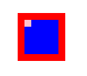

position属性的重要性应该没啥可说的了。

- absolute 绝对定位，相对于 static 定位以外的第一个父元素进行定位。
- relative 相对定位，相对于其自身正常位置进行定位。
- fixed 固定定位，相对于浏览器窗口进行定位。
- static 默认值。没有定位，元素出现在正常的流中。
- inherit 规定应该从父元素继承 position 属性的值。

但是要注意一个问题，absolute 是相对于父元素的哪个属性进行定位的？通过下面的例子我们来看一看。

```css
.container{
    position: relative;
    width: 30px;
    height: 30px;
    margin: 20px;
    border: 10px solid red;
    padding: 10px;
    background: blue;
}
.inner {
    position: absolute;
    width: 10px;
    height: 10px;
    top: 0;
    left: 0;
    background: pink;
}
```



从结果可以看出，是相对于 static 定位以外的第一个父元素的 padding 来定位的。

### 粘性定位: sticky

CSS3中新增了一个 [position:sticky 属性](https://developer.mozilla.org/zh-CN/docs/Web/CSS/position#语法)。

粘性定位可以被认为是相对定位和固定定位的混合。元素在跨越特定阈值前为相对定位，之后为固定定位。例如：

```css
#one { position: sticky; top: 10px; }
```

在 viewport 视口滚动到元素 top 距离小于 10px 之前，元素为相对定位。之后，元素将固定在与顶部距离 10px 的位置，直到 viewport 视口回滚到阈值以下。

须指定 top, right, bottom 或 left 四个阈值其中之一，才可使粘性定位生效。否则其行为与相对定位相同。

**注意** : Internet Explorer, Edge 15 及更早 IE 版本不支持 sticky 定位。 Safari 需要使用 -webkit- prefix。

sticky 属性用来做移动端 tab 滚动到顶部吸附很好用。如下面示例：


